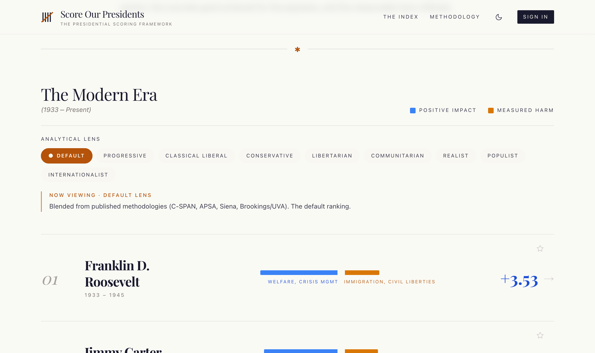
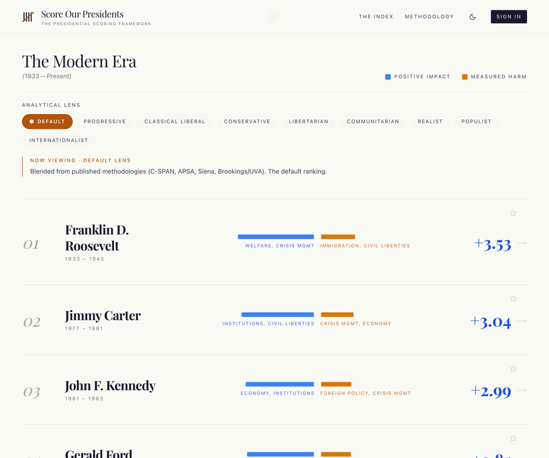
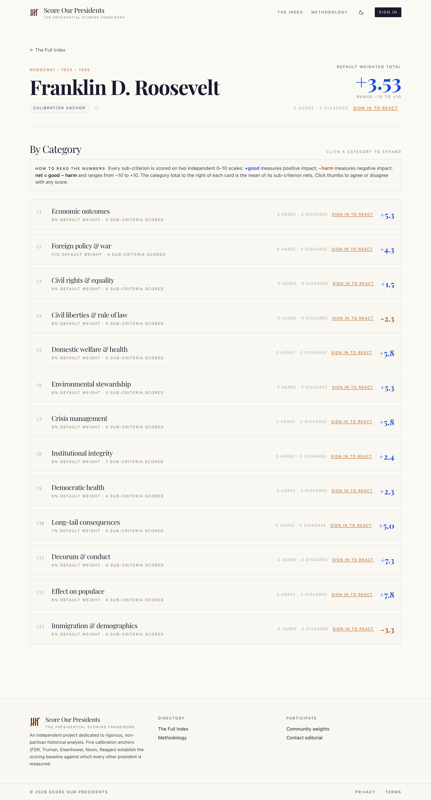

# Score Our Presidents

> Presidential greatness depends on what you value. This makes that explicit.

[](https://www.scoreourpresidents.org/)
[](https://github.com/RealMaxPower/score-our-presidents/actions/workflows/ci.yml)
[](https://nextjs.org/)
[](https://www.typescriptlang.org/)
[](LICENSE)
[](LICENSE-spec)

A public, non-partisan project that ranks the **16 modern US presidents** (FDR through Trump T2) on the *measurable good* and *measurable harm* of their administrations — then lets you re-rank the **same evidence** under nine different value lenses.

The headline insight: there is no single "correct" ordering. Weight civil rights heavily and one ranking appears; weight foreign-policy restraint and a different one does. Most rankings hide that choice. This one puts the dial in your hands and shows its work — every score traces to cited, documented evidence under a published rubric.

> **The scores are editorial opinion, not statements of objective fact** — derived by applying an open rubric to sourced evidence. See [DISCLAIMER.md](DISCLAIMER.md) for the editorial-and-legal notice and the corrections / right-of-reply process.

**Try it live → [scoreourpresidents.org](https://www.scoreourpresidents.org/)**

[](https://www.scoreourpresidents.org/)

---

## The nine lenses

Each lens re-weights the *identical* per-president evidence. Switch lenses on any page and the rankings recompute live.

| Lens | What it prioritizes |
|---|---|
| **Default (expert blend)** | Blended from published methodologies (C-SPAN, APSA, Siena, Brookings/UVA). The default ranking. |
| **Progressive** | Civil rights, welfare, environment, immigration. Structural outcomes over tone. |
| **Classical Liberal** | Civil liberties, rule of law, institutional integrity. Skeptical of executive expansion. (Locke, Mill, Hayek) |
| **Conservative** | Foreign-policy strength, economic growth, decorum, institutions. (Burke, Kirk, Buckley) |
| **Libertarian** | Civil liberties dominant; foreign-policy restraint and fiscal discipline. |
| **Communitarian** | Welfare, social cohesion, institutions, decorum. (Etzioni, MacIntyre, Sandel, Putnam) |
| **Realist** | Foreign policy, crisis management, long-tail consequences. (Morgenthau, Kennan, Mearsheimer) |
| **Populist** | Anti-elite framing; economic/welfare delivery to working- and middle-class citizens. |
| **Internationalist** | Liberal internationalism / multilateralism; international standing and climate. (Wilson, Acheson) |

[](https://www.scoreourpresidents.org/)

*Same evidence, different values: switch the lens and the ranking re-sorts live. Carter tops the Progressive lens; FDR tops the Realist one.*

## How the scoring works

- **16 presidents** scored: FDR (1933) through Trump T2.
- **13 categories, 56 sub-criteria.** Each sub-criterion gets two independent scores — `good_score` 0–10 and `harm_score` 0–10 — with evidence citations. Net = good − harm.
- **5 calibration anchors** (FDR, Truman, Eisenhower, Nixon, Reagan) define the baseline everyone else is measured against.
- **Era-anchored benchmarks** for the 6 era-sensitive categories (foreign policy, civil rights, civil liberties, environment, democratic health, decorum) — so a 1940s president isn't judged by 2020s norms.
- **§4.6 multi-attribution cap** limits cross-category attribution to ≤2 sub-criteria per event (handles Watergate, January 6, Iran-Contra, Japanese internment cleanly).
- **Category 10 (long-tail effects) dropped** for in-office and ≤5-years-post-term presidents (Trump T2, Biden), since the verdict isn't in yet.

The scores live in [`scores/*.yaml`](scores) — one human-readable file per president, with every sub-criterion judgment and its sources. Full methodology: [`docs/methodology/spec-v1.2-redlined.md`](docs/methodology).

[](https://www.scoreourpresidents.org/president/franklin_d_roosevelt)

*Every scorecard breaks down to 13 categories and 56 sub-criteria — each number traces to cited evidence you can expand.*

## Quickstart

```bash
cp .env.example .env       # then edit DATABASE_URL etc.
docker compose up -d       # Postgres bound to 127.0.0.1
pnpm install
pnpm db:migrate            # creates the schema (22 tables)
pnpm db:seed               # loads 16 presidents from scores/*.yaml
pnpm dev                   # http://localhost:3000
```

Want dev login accounts too? `pnpm tsx db/seed-dev-users.ts` creates `max@`/`alex@`/`newbie@example.com`.

See [SETUP.md](SETUP.md) for prerequisites, Supabase setup, and troubleshooting.

### What's working today

- **Public site** — home with nine-lens chips, president scorecards, sub-criterion cross-president views, methodology, privacy, terms, sitemap, dynamic OG images.
- **Accounts** — NextAuth.js v5 with three providers gated by env (dev credentials, Google OAuth, Resend magic-link); JWT sessions.
- **Participation** — submit your own scores with evidence, vote on scores, set per-user weights, bookmark presidents and sub-criteria.
- **Admin + forensics** — `/admin` dashboard with audit-log viewer and user/score moderation, behind a two-factor unlock; every sign-in, score-lifecycle event, and admin action is written to an append `audit_logs` table.
- **Security hardening** — strict CSP/HSTS headers, Zod-validated env that refuses unsafe production starts, per-IP rate limits, SSRF-safe evidence-URL validation, and `server-only` markers that turn client-leak mistakes into compile errors.

## Reproduce the rankings

The rankings aren't a black box — recompute them yourself from the YAML and weight vectors:

```bash
pnpm verify-rankings       # python3 scripts/compute_rankings.py
```

## Stack

| Layer | Technology |
|---|---|
| App | Next.js 15.5 (App Router) · React 19 · TypeScript strict |
| Styling | Tailwind 3 · custom palette (cream/charcoal/rust — deliberately not partisan red/blue) |
| Data | Prisma 5 → Postgres 16 (Docker locally; Supabase in prod via the Supavisor pooler) |
| Auth | NextAuth.js v5 — Credentials (dev) / Google / Resend; JWT sessions |
| Rate limit | Upstash Redis sliding window (in-process fallback in dev) |
| Observability | Sentry (server + opt-in client), DSN gated by env, off by default |
| Tests | Vitest (unit); Playwright (E2E) planned |
| Hosting | Vercel · Supabase · Upstash · Sentry · Fly.io (workers, deferred) |

## Repo layout

```
app/              Next.js routes — home, /president/[slug], /sub-criterion/[n],
                  /methodology, /me/*, /admin/*, /api/*
components/       Score forms, vote/bookmark widgets, rankings sections, nav
lib/              lens-presets.ts (the 9 weight vectors), scoring, auth, env,
                  prisma, rate-limit — env/auth/prisma marked server-only
db/               Prisma schema, migrations, seed scripts, outlier detection
scores/           16 YAML files — one per president, scores + evidence + sources
scripts/          compute_rankings.py (reproducibility)
docs/             methodology/ (spec, era benchmarks, weight validation), admin.md
```

## Documentation

- **[SETUP.md](SETUP.md)** — local dev, troubleshooting, useful scripts.
- **[DEPLOYMENT.md](DEPLOYMENT.md)** — production runbook (Vercel + Supabase + Upstash + Sentry): env vars, first-deploy sequence, verification, rollback.
- **[docs/admin.md](docs/admin.md)** — operator guide for `/admin/*`: bootstrap, unlock flow, moderation.
- **[docs/methodology/](docs/methodology)** — the canonical spec, era-anchored rubric, cross-president calibration, and the published-methodology defense for the nine weight vectors.
- **[architecture-v1.md](architecture-v1.md)** — full architecture (planning-era doc; live stack per DEPLOYMENT.md).
- **[brand.md](brand.md)** — visual identity, type, colors.

## Contributing

There are **two distinct paths**, because the repo bundles three differently-licensed bodies of work:

1. **Code** (MIT) — bug fixes, accessibility, performance, tests, new UI. Normal PR flow. Good first contributions: an accessibility pass on a single widget, or a test for an untested `lib/` function.
2. **Methodology, scoring, or evidence** (CC BY-SA / CC BY) — disagree with a score, found a sourcing error, or want to challenge a calibration anchor? **Please don't open a PR** — these go through a documented editorial process, not code review.

Start with **[CONTRIBUTING.md](CONTRIBUTING.md)** to pick the right path, and **[CODE_OF_CONDUCT.md](CODE_OF_CONDUCT.md)** for community expectations. Before any code PR: `pnpm typecheck && pnpm lint && pnpm test`.

## License

Score Our Presidents is published under a three-way split, so code, methodology, and data each carry the license best suited to their reuse.

| Scope | License | File |
|---|---|---|
| **Site source code** — everything required to run the site | MIT | [`LICENSE`](LICENSE) |
| **Framework specification & methodology** — `docs/methodology/*` and the methodology pages on the site | CC BY-SA 4.0 | [`LICENSE-spec`](LICENSE-spec) |
| **Scoring evidence** — the per-president YAML files in [`scores/`](scores/) | CC BY 4.0 | [`LICENSE-data`](LICENSE-data) |

Canonical license texts: [MIT](https://opensource.org/license/mit) · [CC BY-SA 4.0](https://creativecommons.org/licenses/by-sa/4.0/legalcode.txt) · [CC BY 4.0](https://creativecommons.org/licenses/by/4.0/legalcode.txt).

### Why the split

- **MIT** for the site code maximizes practical reuse with no return obligation.
- **CC BY-SA 4.0** for the framework keeps the methodology open as it's adapted — derivative methodologies must remain under the same license, preventing enclosure of the rubric by commercial actors.
- **CC BY 4.0** for the scoring evidence minimizes friction for academic and journalistic reuse of the dataset — attribution only, no share-alike obligation.

### Attribution

When reusing the methodology or the dataset, attribute as:

> Score Our Presidents (the Presidential Scoring Framework) — https://www.scoreourpresidents.org

For academic work, see [CITATION.cff](CITATION.cff).

### Editorial scores are opinion

The scores, rankings, and evidence narratives are editorial opinion derived by applying a published rubric to documented, cited evidence — not statements of objective fact about any person. See [`DISCLAIMER.md`](DISCLAIMER.md) for the full editorial-and-legal notice, including the corrections / right-of-reply process.

Third-party trademarks — including the names and likenesses of public figures appearing in the project — remain the property of their respective owners. Their appearance here is nominative and editorial.

### License correspondence

Questions about reuse, requests for advance permission, or other license correspondence: legal@scoreourpresidents.org.

---

*New here? Run it locally with [SETUP.md](SETUP.md), then read [`docs/methodology/spec-v1.2-redlined.md`](docs/methodology) to see how every number is derived.*
