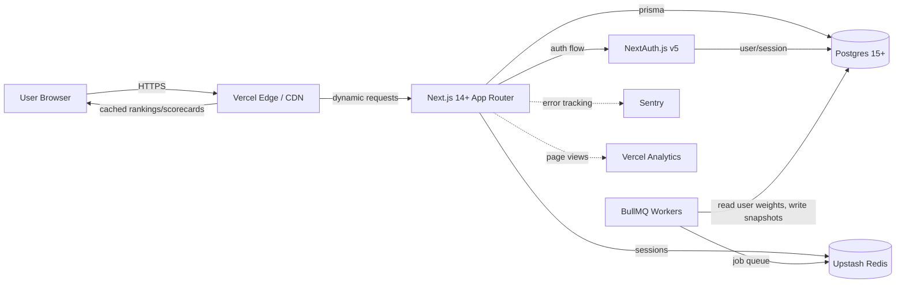
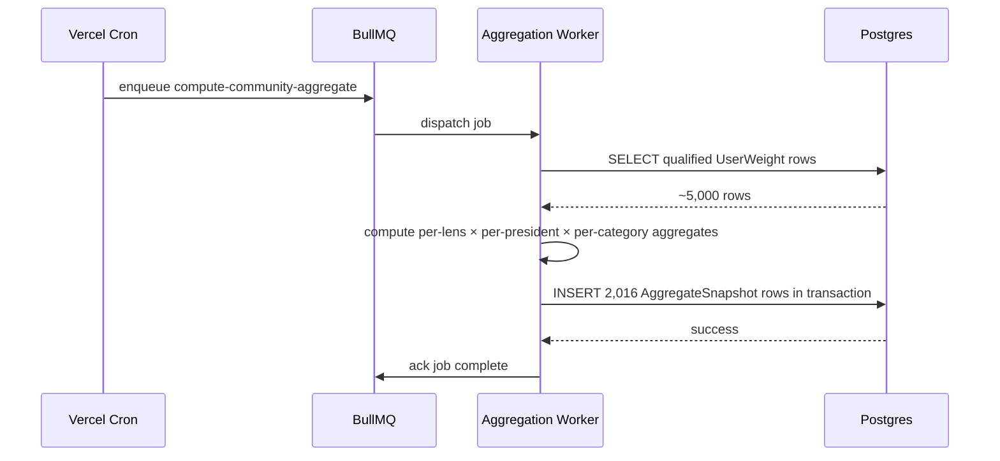

# Architecture — Score Our Presidents v1.0

**Spec basis:** v1.2 + PRD v1
**Workstream:** G — Architecture
**Date:** 2026-05-11 (last reviewed for accuracy 2026-05-14)
**Status:** Build in progress — see README "Shipped, working today" for current state

> **2026-05-14 deltas**: implementation is on **Next.js 15.5 / React 19** (this doc still references 14+ in diagrams; the architectural decisions all hold). Auth is wired via NextAuth.js v5 with Credentials/Google/Resend providers per §2. Audit logging is implemented as the `AuditLog` table (added beyond the original schema). Rate limiting has both Upstash and in-process modes per §9.
>
> **2026-05-15 deltas**: production stack swapped to **Supabase** (Postgres) and **Vercel Analytics** in place of the originally-planned Neon and Plausible. Worker hosting plan is **Fly.io** (originally Railway) but workers are not yet built or deployed. Admin surface gained an `ADMIN_TOKEN` second-factor unlock cookie on top of NextAuth + `isAdmin`. Sentry is wired via `instrumentation.ts` (no-op when DSN unset). Authoritative deploy runbook lives in [`DEPLOYMENT.md`](DEPLOYMENT.md); when this doc and that doc disagree, `DEPLOYMENT.md` is correct.

---

## 1. Top-line architecture summary



**Stack at a glance:**

- **Frontend:** Next.js 15.5 App Router (RSC + client components). Tailwind. (shadcn/ui not adopted; bespoke components.)
- **API:** Next.js Route Handlers (REST-style). tRPC rejected — see §3.
- **Auth:** NextAuth.js v5 with Prisma adapter. Google OAuth + email magic-link (Resend). Admin paths gated by an additional `ADMIN_TOKEN` unlock cookie.
- **Database:** Postgres 15+ on Supabase (Supavisor pooled connection at runtime; direct connection for migrations via Prisma `directUrl`). Prisma ORM.
- **Background jobs:** BullMQ on Upstash Redis. Single worker process planned per worker type. **Not yet built or deployed.**
- **Hosting:** Vercel for Next.js. Supabase for Postgres. Upstash for Redis. Fly.io is the planned worker host.
- **Observability:** Sentry error tracking (server + opt-in client) via `instrumentation.ts`. Vercel Analytics for cookieless aggregate page views. Vercel function logs for `console.*` (structured logger deferred).
- **CI/CD:** Vercel auto-deploy on push to `main`. GitHub Actions workflow not yet wired.

**Out of scope for v1:** Tight clustering / multi-region, custom observability dashboards (Vercel built-in suffices), webhook integrations.

---

## 2. Auth (NextAuth.js v5)

### Configuration

NextAuth.js v5 (formerly Auth.js) with Prisma adapter. Configuration in `app/api/auth/[...nextauth]/route.ts` or `auth.ts`.

**Providers (v1):**

- **Google OAuth** — primary path. Quick onboarding for engaged voters who use Google accounts.
- **Email magic-link** — fallback for users without Google preference. Uses Resend (or similar transactional email) as send-from infrastructure.

**Providers deferred to v1.1:**

- GitHub OAuth (small user base in our target persona)
- Apple Sign-In (iOS user share modest, deferred)

**Provider not used:** Username/password — adds attack surface (password storage, password reset flows) for no benefit at this user-base size.

### Session strategy

NextAuth.js stores sessions in Postgres via Prisma adapter (`Session` and `Account` tables auto-generated by adapter; our schema's `UserSession` maps to this).

- Session token: opaque random string (32+ bytes).
- Session lifetime: 30 days. Renewal on each authenticated request.
- Session cookie: HttpOnly, Secure, SameSite=Lax.

### Account verification tiers

Per PRD §8:

| Tier | Requirements | Capabilities |
|------|-------------|--------------|
| Anonymous | None | Browse, lens-switch, view scorecards/evidence/methodology |
| Authenticated (unverified) | Account exists | All above + save personal weights (not yet counted toward community aggregate) |
| Authenticated (verified) | Email verified | All above + community aggregate visibility |
| Qualified for community aggregate | Email verified + account age ≥ 7 days | Weights counted toward community aggregate per spec §5.4 |
| Admin | Manual flag | All above + access to admin tooling (anchor review, evidence revision) |

### Email verification

Magic-link providers verify email implicitly (clicking the link == verified). Google OAuth provides verified-email field; trust it.

For email magic-link signup with bot risk: rate-limit account creation per IP.

---

## 3. API surface — REST via Next.js Route Handlers

### Decision: REST over tRPC

**Considered:** tRPC for type-safe RPC between Next.js client and server.

**Chose:** REST via Next.js Route Handlers (`app/api/.../route.ts`).

**Rationale:**

1. **Caching.** REST endpoints are CDN-cacheable via `revalidate` + cache headers. tRPC requires bespoke caching logic. For our high-cacheability use case (default and lens-preset rankings are highly cacheable), REST is structurally simpler.
2. **External tools.** Journalists, researchers, third-party integrations all expect REST URLs. tRPC requires generated client. Even though we don't ship a public API in v1, the data flow architecture is REST-shaped and future-public-API consideration is easier.
3. **Stability.** Next.js Route Handlers are first-class app-router primitives; tRPC is third-party with rapid version churn.
4. **Marginal type safety loss is recoverable** via Zod schemas at API boundary + shared TypeScript types between server and client (Prisma types are shared anyway).

**Implication:** App-side code uses Zod for request validation; response types are explicitly declared.

### Endpoints (v1.0 read-only MVP)

| Method | Endpoint | Purpose | Auth | Cacheable? |
|--------|----------|---------|------|------------|
| GET | `/api/rankings?lens={slug}` | Get sorted ranking under lens | Public | Yes (CDN; revalidate weekly) |
| GET | `/api/presidents/{slug}` | Full president scorecard | Public | Yes (CDN; revalidate weekly) |
| GET | `/api/sub-criteria/{number}` | Cross-president view for sub-criterion | Public | Yes (CDN; revalidate weekly) |
| GET | `/api/presidents` | List all 16 with basic metadata | Public | Yes (CDN; revalidate weekly) |
| GET | `/api/lenses` | List all 9 lens presets | Public | Yes (CDN; revalidate weekly) |
| GET | `/api/methodology/eras` | Era benchmarks data | Public | Yes (CDN; revalidate weekly) |

### Endpoints (v1.0 authenticated)

| Method | Endpoint | Purpose | Auth |
|--------|----------|---------|------|
| GET | `/api/me` | Current user profile | Required |
| POST | `/api/me/weights` | Save personal weights | Required |
| GET | `/api/me/ranking` | Personal-weighted ranking | Required |
| POST | `/api/me/bookmarks` | Save bookmark | Required |
| DELETE | `/api/me` | Delete account (right-to-be-forgotten) | Required |

### Endpoints (v1.1 community aggregate)

| Method | Endpoint | Purpose | Auth |
|--------|----------|---------|------|
| GET | `/api/community/ranking?lens={slug}` | Community aggregate ranking | Authenticated (qualified tier) |
| GET | `/api/community/aggregate/{president-slug}` | Per-president aggregate detail | Authenticated (qualified tier) |

### Endpoints (v2 user scoring) — deferred

| Method | Endpoint | Purpose |
|--------|----------|---------|
| POST | `/api/me/scores` | Submit user score with evidence |
| GET | `/api/me/scores` | List my scores |
| POST | `/api/admin/anchors/{slug}/approve` | Admin: approve anchor scoring |

### Request/response patterns

All responses are JSON. Schema validation via Zod on request bodies. Response types declared explicitly:

```typescript
// app/api/rankings/route.ts
const querySchema = z.object({
  lens: z.enum(['default', 'progressive', 'classical_liberal', 'conservative',
                'libertarian', 'communitarian', 'realist', 'populist', 'internationalist']),
});

type RankingResponse = {
  lens: string;
  rankings: Array<{
    rank: number;
    presidentSlug: string;
    weightedTotal: number;
  }>;
  generatedAt: string;
};
```

Errors use standard HTTP status codes with JSON body:
```json
{ "error": "VALIDATION_ERROR", "details": [...], "requestId": "..." }
```

---

## 4. Data access layer (Prisma)

### Client instantiation

Singleton pattern to avoid Prisma client recreation in Next.js dev/HMR:

```typescript
// lib/prisma.ts
import { PrismaClient } from '@prisma/client';

const globalForPrisma = global as unknown as { prisma: PrismaClient };

export const prisma =
  globalForPrisma.prisma ||
  new PrismaClient({
    log: process.env.NODE_ENV === 'development' ? ['query', 'error'] : ['error'],
  });

if (process.env.NODE_ENV !== 'production') globalForPrisma.prisma = prisma;
```

### Query patterns

- **List rankings:** Single query fetching ExpertScore + SubCriterion + Category. Compute lens-weighted total in app code. Cache result per lens.
- **President scorecard:** Single query with nested includes (ExpertScore + SubCriterion + Evidence). Single round-trip to DB.
- **User weights:** Direct SELECT WHERE userId.
- **Snapshot insert:** Single transaction inserts ~2,000 AggregateSnapshot rows.

### Connection pooling

Postgres connection pooling via Neon's built-in pooler (or PgBouncer if hosting on platform without pooler). Configure `DATABASE_URL` to use pooled connection for app traffic; non-pooled for migrations.

---

## 5. Aggregation layer (v1.1+)

### Snapshot computation

BullMQ job `compute-community-aggregate` triggered nightly at 02:00 UTC via cron-like schedule. Job worker is a separate Node.js process (Vercel doesn't support long-running processes; runs on Railway or as a Fly.io worker).



### Computation algorithm

For each lens preset (9 total):

```pseudo
qualified_users = SELECT user_profiles WHERE email_verified AND account_age_days >= 7 AND deleted_at IS NULL
weights[user] = SELECT user_weights WHERE user_id IN qualified_users

if count(qualified_users) < 100: skip (insufficient qualifying users)

for each president, category:
    user_nets = []
    for each user in qualified_users:
        # Compute user-weighted net for this category
        net = avg(sub_criterion_nets[president][category])
        weight = weights[user][category]
        user_nets.append((net, weight))

    median_good, median_harm = compute_weighted_median(user_nets)
    iqr_good, iqr_harm = compute_weighted_iqr(user_nets)

    INSERT AggregateSnapshot(snapshot_date, lens_preset_id, president_id, category_id, ...)
```

### Edge cases handled

- **Cat 10 dropped users:** Snapshot includes `category_id = 10` row marked with `insufficient_time_elapsed: true`. UI handles display.
- **Outlier users (v1.1+):** Pre-filter weight vectors that deviate >3 std deviations from joint-distribution centroid. Reduce their contribution by `reputation_score / 1.0` factor.
- **Brigading attempts (v2):** Reputation-based weighting + outlier flagging.

---

## 6. Anti-brigading architecture

### Layered defenses

```
Layer 1: Rate limits (Cloudflare / Vercel WAF)
Layer 2: Account verification gating
Layer 3: Reputation scoring
Layer 4: Outlier detection in aggregation
Layer 5: Manual admin review
```

### Layer 1: Rate limits

Implemented via Vercel Rate Limit or Upstash Ratelimit library:

- **Anonymous endpoints:** 60 requests/minute per IP.
- **Authenticated read endpoints:** rate-limited per user.
- **Authenticated write endpoints:** rate-limited per user.
- **Account creation:** rate-limited per IP.
- **Magic-link email send:** rate-limited per email and per IP.

### Layer 2: Account verification gating

User must verify email before their weights count toward community aggregate. Per PRD §8.

### Layer 3: Reputation scoring

`UserProfile.reputationScore` updated on schedule based on:

- Account age: +0.1 per 30 days, capped at +1.0 after 10 months
- Email verification: +0.5 (one-time)
- OAuth verification (Google): +0.3 (one-time)
- Weight-vector consistency: +0.2 if user's weight vector is within 2 std dev of mean centroid for ≥4 consecutive snapshots
- Weight-vector outlier: -0.2 per snapshot where outside 3 std dev

Reputation scores feed into community aggregate weighting.

### Layer 4: Outlier detection

In aggregation job:

1. Compute joint-distribution mean and covariance across all 13 category weights.
2. Mahalanobis distance from each user's vector to centroid.
3. Users with distance > 3.0 contribute at 0.5× weight to community aggregate.
4. Users with distance > 5.0 contribute at 0× (effectively excluded; flagged for admin review).

### Layer 5: Manual admin review

Admin dashboard (built in v1.1) shows users flagged as extreme outliers. Admin can:

- Suspend account (reputation_score = 0)
- Verify legitimate (mark as expected outlier, exempt from auto-detection)
- Soft-delete (deletionRequestedAt set; cleaned up by next deletion cycle)

---

## 7. Caching strategy

### Cache layers

```
Vercel Edge CDN (1 minute TTL for public ranking endpoints)
  └─ Next.js ISR (revalidate weekly for static pages)
       └─ Application logic (computed values per request)
            └─ Prisma + Postgres (1 query per page load)
```

### Cacheable resources

| Resource | TTL | Invalidation trigger |
|----------|-----|----------------------|
| Default-weighted ranking | 1 minute (CDN) + 1 week (ISR) | Schema change or scoring revision |
| Lens-preset rankings (9 of them) | 1 minute + 1 week | Schema change or lens-weight revision |
| President scorecards (16) | 1 minute + 1 week | Score revision |
| Sub-criterion cross-president views (56) | 1 minute + 1 week | Score revision |
| Methodology page | 1 minute + 1 week | Spec version bump |

### Personal rankings

Per-user personalized rankings are computed server-side per request — no caching. Pre-fetched user weights + pre-computed category nets enable fast (<100ms) computation.

### Cache invalidation

Triggered by:
- Score revision (manual admin tooling)
- Spec version bump (new active SpecVersion row)
- Anchor approval status change (draft_pending → reviewed_anchors)

Invalidation uses `revalidateTag()` (Next.js 13.4+) tags grouped by resource type.

---

## 8. Observability

### Structured logging (Pino)

All API routes log via Pino in JSON format:

```typescript
// lib/logger.ts
import pino from 'pino';

export const logger = pino({
  level: process.env.LOG_LEVEL ?? 'info',
  redact: ['req.headers.cookie', 'req.headers.authorization'],
});

// In API route
logger.info({ userId, route: '/api/me/weights' }, 'User saved weights');
```

Logs collected by Vercel and exportable to Datadog/Better Stack if needed.

### Error tracking (Sentry)

`@sentry/nextjs` configured at app boot. Captures:
- Unhandled errors in Next.js routes
- React component errors
- BullMQ worker errors

Sentry source maps generated and uploaded on each deploy.

### Page analytics (Vercel Analytics)

Vercel Analytics (privacy-respecting, no cookies, no PII) on every page via `@vercel/analytics`, mounted in [app/layout.tsx](app/layout.tsx). Tracks page views and referrers in aggregate. Custom events (lens switches, login completions, personal-weights-saved) are not currently emitted — add via `track()` from `@vercel/analytics` if needed.

### Custom metrics (v1.1+)

Optional Prometheus-style metrics endpoint for internal monitoring:
- `aggregate_snapshot_duration_seconds` (histogram)
- `lens_switch_count_total` (counter by lens)
- `evidence_url_check_failure_rate` (gauge)

For v1, Vercel Analytics + Sentry breadcrumbs suffice.

### Performance budgets

Tracked via Vercel Speed Insights:
- First Contentful Paint: <1.5s on 4G mobile
- Largest Contentful Paint: <2.5s
- Cumulative Layout Shift: <0.1
- Interaction to Next Paint: <200ms

---

## 9. Deployment

### Hosting

> The runbook source of truth is [`DEPLOYMENT.md`](DEPLOYMENT.md). Bullets below are the architectural shape; details, env-var tables, and verification checklists live there.

- **Next.js app:** Vercel. Auto-deploy from GitHub `main` branch.
- **Postgres:** Supabase. Pooled (Supavisor port 6543) at app runtime; direct (port 5432) for `prisma migrate deploy`, wired via Prisma `directUrl`.
- **Redis:** Upstash (serverless Redis). REST API for `@upstash/ratelimit` from the app; regular TCP URL for BullMQ workers when they ship.
- **BullMQ workers:** Fly.io is the planned host. Vercel can't run long-lived processes; Cloudflare Workers don't fit BullMQ's long-poll model. **Not yet built or deployed.**
- **Email (magic-link):** Resend (auto-detected by Auth.js when `AUTH_RESEND_KEY` + `EMAIL_FROM` are set).
- **Errors:** Sentry. **Page analytics:** Vercel Analytics (cookieless, no PII).

### Environment variables

Authoritative table — including required-vs-recommended split, prod vs dev semantics, and validator behavior — is in [`DEPLOYMENT.md` §3.2](DEPLOYMENT.md#32-set-environment-variables). Schema lives in [`lib/env.ts`](lib/env.ts).

Quick reference:

```
DATABASE_URL=postgresql://...?pgbouncer=true&connection_limit=1
DATABASE_URL_UNPOOLED=postgresql://...
NEXTAUTH_URL=https://example.org
NEXTAUTH_SECRET=<openssl rand -base64 32>
ADMIN_TOKEN=<openssl rand -base64 32>      # admin second factor
AUTH_DISABLE_DEV_CREDENTIALS=1
AUTH_DISABLE_DEV_COOKIE=1
GOOGLE_CLIENT_ID=...
GOOGLE_CLIENT_SECRET=...
AUTH_RESEND_KEY=re_...
EMAIL_FROM=noreply@scoreourpresidents.org
UPSTASH_REDIS_REST_URL=...
UPSTASH_REDIS_REST_TOKEN=...
SENTRY_DSN=...
NEXT_PUBLIC_SENTRY_DSN=...                 # only if reporting browser errors
```

### CI/CD

GitHub Actions workflow:

```yaml
on: [push]
jobs:
  test:
    - install
    - lint (ESLint)
    - typecheck (tsc --noEmit)
    - unit tests (Vitest)
    - integration tests (Playwright headless, optional)
  deploy:
    needs: test
    if: branch == main
    - Vercel deploy via vercel CLI
```

Vercel handles preview deploys for PRs automatically.

### Database migrations on deploy

Migrations run via `prisma migrate deploy` in pre-deploy hook. Vercel build phase includes:
1. `prisma generate` — generate client
2. `prisma migrate deploy` — apply pending migrations against production DB
3. `next build` — build app

Failed migration aborts deploy.

---

## 10. Security considerations

Detailed legal-review and security-review documents to follow (Phase 2.5). High-level:

- **Auth:** NextAuth.js v5 standard configuration. No custom auth code.
- **Authorization:** Middleware checks user authentication for `/me/*` and `/community/*` endpoints. Admin endpoints check `isAdmin`.
- **Input validation:** Zod schemas on all API route inputs.
- **SQL injection:** Mitigated by Prisma (parameterized queries throughout).
- **XSS:** React auto-escapes. dangerouslySetInnerHTML used only for trusted-content (methodology markdown rendering with sanitize-html if needed).
- **CSRF:** NextAuth.js handles CSRF tokens on form submissions.
- **CORS:** Default (same-origin only) for API routes. No cross-origin public API in v1.
- **Rate limiting:** Per §6 above.
- **HTTPS only:** Vercel enforces TLS. HSTS preload list submission post-launch.
- **CSP:** Configured in `next.config.js` headers per OWASP recommendations.
- **Secrets management:** Vercel env variables. No secrets in code repository.

---

## 11. Out of scope for v1 architecture

Reserved for v1.1+:

- Webhook integration for evidence-source verification
- Public API for academic/journalistic access
- Multi-language methodology (i18n)
- Live notifications (websockets) for anchor-status changes
- Mobile native apps
- Search beyond president name (full-text on notes, evidence)
- Custom moderation dashboard beyond admin review

Reserved for v2:

- User-submitted scoring infrastructure
- Reputation algorithm hardening (ML-based outlier detection)
- AI-assisted evidence-gathering for users
- Comparison views (compare 2 presidents directly)

---

## 12. Acceptance criteria for Workstream G

- ✓ Auth strategy specified (NextAuth.js v5 + Prisma)
- ✓ API surface chosen (REST + Route Handlers) with all endpoints documented
- ✓ Aggregation layer specified for v1.1
- ✓ Anti-brigading defenses layered across 5 levels
- ✓ Caching strategy specified per resource
- ✓ Observability (Pino, Sentry, Plausible) configured
- ✓ Deployment platform chosen (Vercel + Neon + Upstash + Railway)
- ✓ Security considerations documented

Ready for Workstream H (sprint plan).

---

*End of architecture-v1.md. Next deliverable: sprint plan (Workstream H).*
